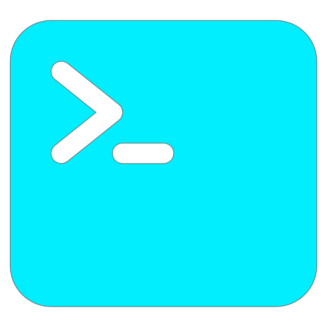
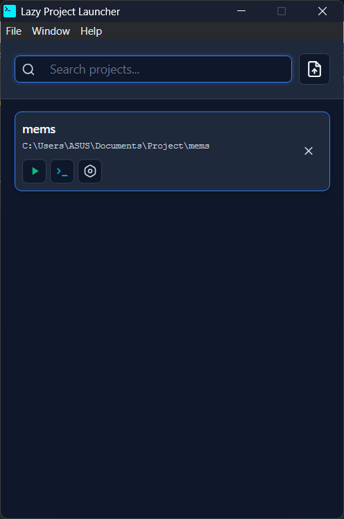

# ➤ Lazy Project Launcher

  

A simple and efficient project launcher built with Electron and Vue.js for managing multiple development projects.

[Download](https://github.com/yeongpin/lazy-project-launcher/releases) • [Features](#features)

